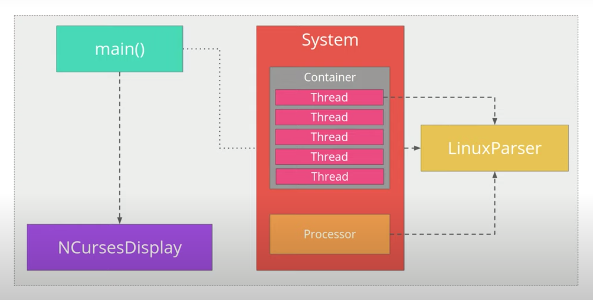

# System Monitor Project
This project implements a system monitor in C++ that resembles the monitoring program htop in Linux systems.


## C++ Files Location

The src directory contains the following files:
```
main.cpp
format.cpp
linux_parser.cpp
ncurses_display.cpp
process.cpp
processor.cpp
system.cpp
```

The inlcude directory contains the following files:
```
format.h
linux_parser.h
ncurses_display.h
process.h
processor.h
system.h
```


## Project Structure Diagram

This diagram shows the overall project structure for the project:




## Instructions

1. Clone the project repository: `git clone https://github.com/udacity/CppND-System-Monitor-Project-Updated.git`

2. Build the project: `make build`

3. Run the resulting executable: `./build/monitor`


## ncurses
[ncurses](https://www.gnu.org/software/ncurses/) is a library that facilitates text-based graphical output in the terminal. This project relies on ncurses for display output.

Within the Udacity Workspace, `.student_bashrc` automatically installs ncurses every time you launch the Workspace.

If you are not using the Workspace, install ncurses within your own Linux environment: `sudo apt install libncurses5-dev libncursesw5-dev`

## Make
This project uses [Make](https://www.gnu.org/software/make/). The Makefile has four targets:
* `build` compiles the source code and generates an executable
* `format` applies [ClangFormat](https://clang.llvm.org/docs/ClangFormat.html) to style the source code
* `debug` compiles the source code and generates an executable, including debugging symbols
* `clean` deletes the `build/` directory, including all of the build artifacts

